# YS891-Radio-UI — the full-feature tour

A standalone Windows front panel and **complete exercise harness** for the Yaesu FT-891, built
entirely on the published NuGet packages [`FT891.Core`](https://www.nuget.org/packages/FT891.Core)
and [`FT891.Simulator`](https://www.nuget.org/packages/FT891.Simulator) (v2.0.0) — no project
references, no third-party dependencies, .NET Framework 4.8 WPF. Every public member of
`ICatInterface` is reachable from the UI (see [COVERAGE.md](COVERAGE.md)), so the app doubles as
a hardware acceptance test for the whole library.

All screenshots below were taken live against the **built-in simulator** — zero hardware,
zero setup: `YS891-Radio-UI.exe --sim`.

---

## The panel

A skeuomorphic FT-891 front panel: drag or scroll the big VFO dial (latest-value-wins coalescing
keeps the wire calm under fast spinning), MULTI knob for AF/RF/MIC/SQL/PWR, real S-meter fed by
the library's `RadioMonitor`, mode/AGC/step/lock/split keys, band-stacking band picker, and a
two-press-armed MOX with a TX lamp that shows the *radio's* truth, never the button's.

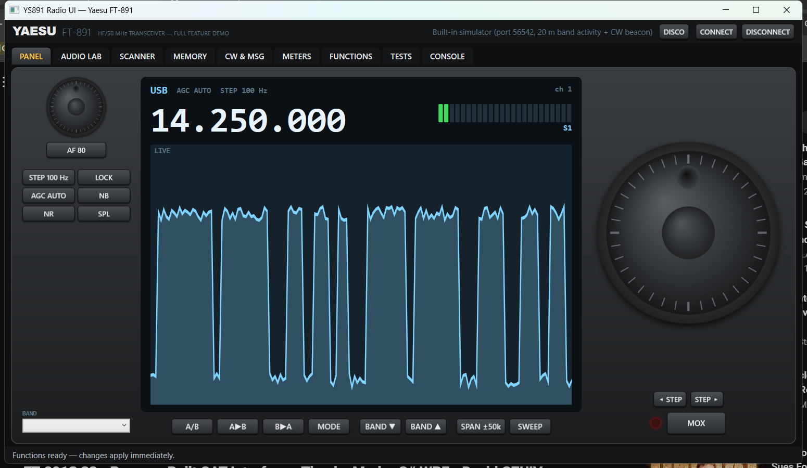

The connect picker offers a real COM port, an external TCP simulator — or the built-in one,
which spins up `SimulatorServer` in-process and wires it a 20 m band model (six stations, several
duty-cycled) plus a decodable CW beacon on 14.058 MHz:

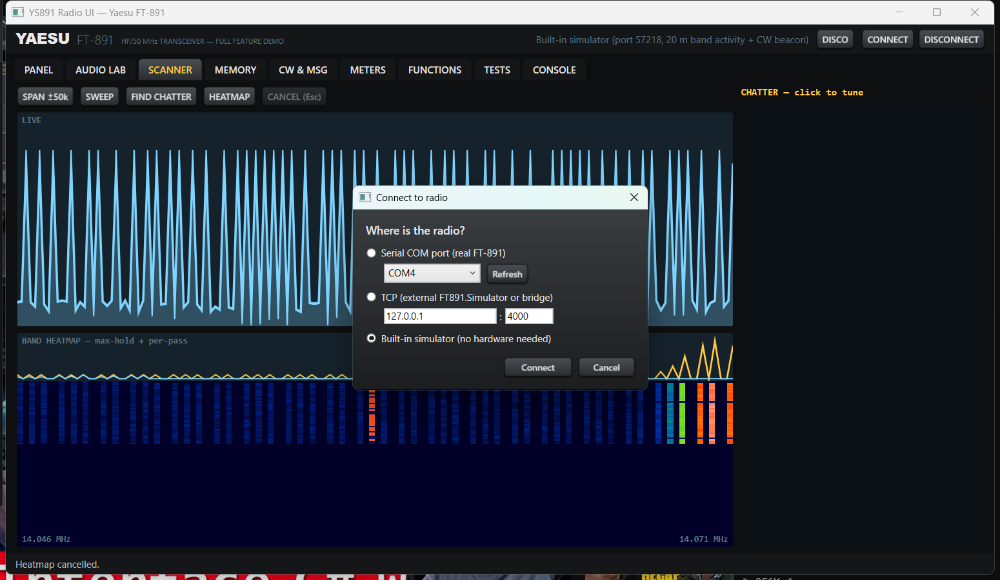

## Scanner

The FT-891 can't stream spectrum over CAT, so the scanner earns its picture the honest way:
step the VFO, read the S-meter, restore the VFO afterwards — every path, even cancellation.

**Sweep** draws the spectrum across the selected span (±12.5k / ±50k / ±250k / ±1M):

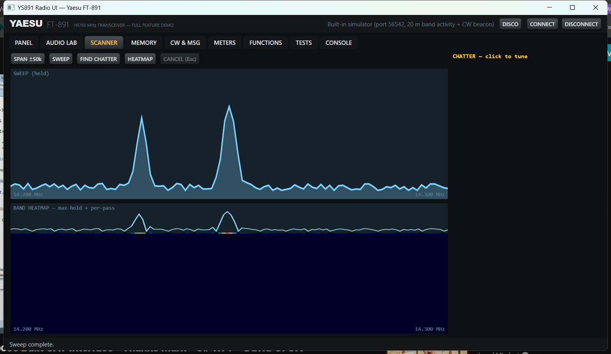

**Find Chatter** scans the span using S-meter peaks *and* the radio's busy flag, then lists the
active frequencies — click one to tune straight to it:

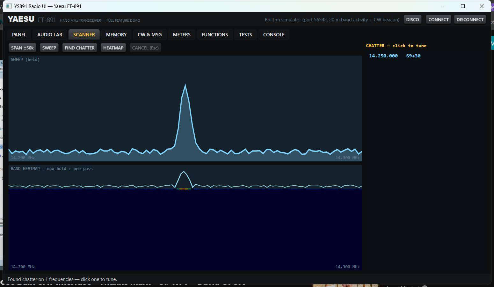

**Heatmap** (ported from the Demo's HeatmapScreen) runs sweep pass after sweep pass: frequency
across, time down, max-hold trace on top. Stations that key on and off show up as dashed stripes —
exactly what you want for finding intermittent activity.

| ±50 kHz | ±250 kHz (the whole band model) | ±12.5 kHz fine |
|---|---|---|
| 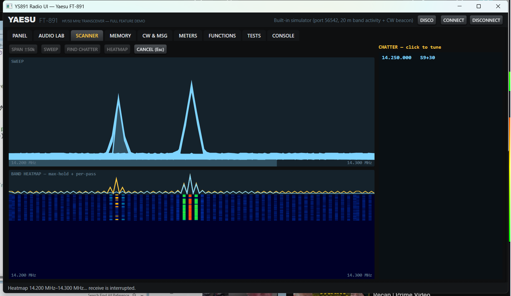 | 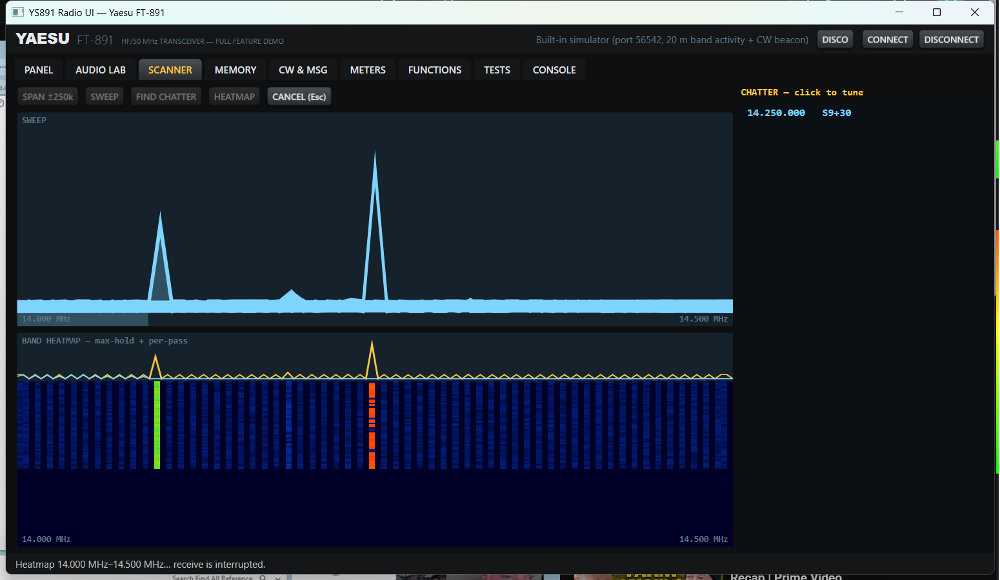 | 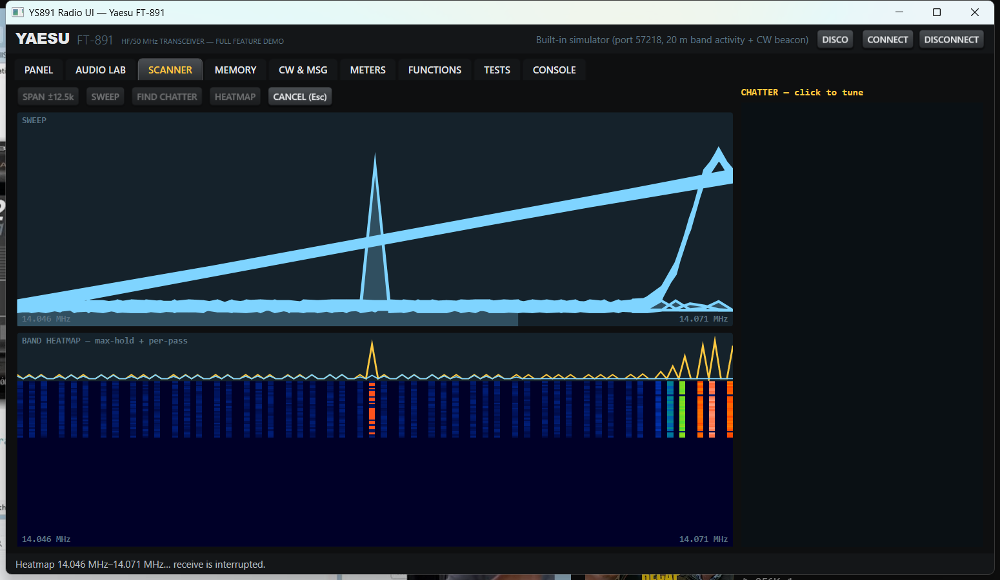 |

## Audio Lab

CAT carries no audio — but the radio does. Run the FT-891's audio out through a splitter into
the PC's **line-in** (the rig's USB port is CAT-only — no built-in sound card) and the Audio Lab
is *literally listening to the receiver*: every CW note, SSB voice and digital burst in the
passband is in that audio, so these views are a true live display of whatever you're tuned to.
A hand-rolled radix-2 FFT feeds three views — oscilloscope waveform, a proper 1980s bar analyzer
with falling red peak caps, and a scrolling waterfall. For zero-cable demos there's also
**"System audio (what you hear)"** via hand-rolled WASAPI loopback: whatever Windows is playing.

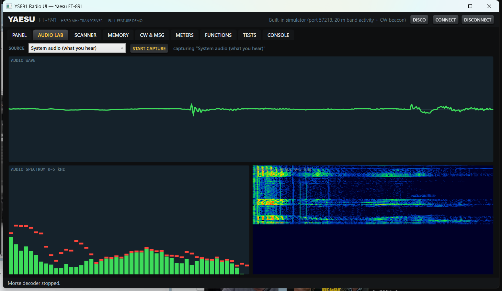
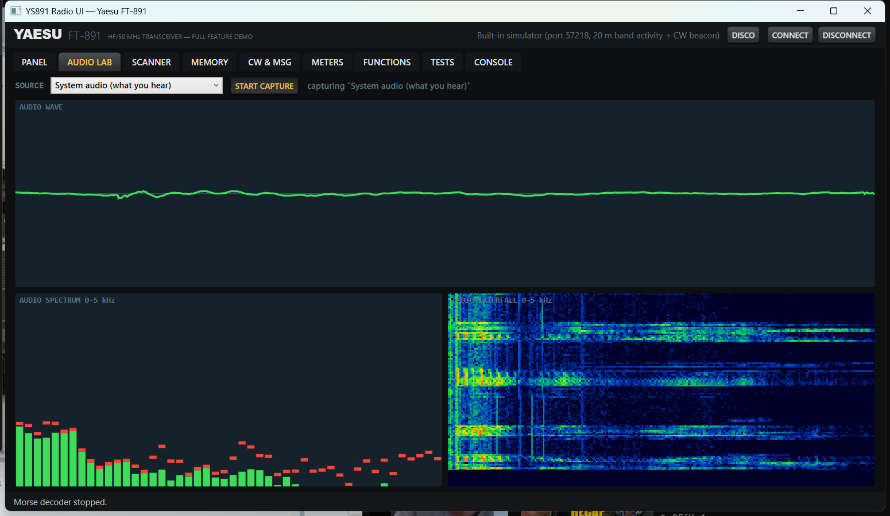

## CW & Messages — including a live Morse decoder

Send CW, manage the five keyer memories, zero-in, record/playback voice messages — and decode
Morse **from the S-meter alone**: the meter rises and falls with the keying, the decoder
(`FT891.Simulator.Morse.MorseDecoder`, straight from the NuGet package) turns that into text,
with CW shorthand expanded to plain English. Against the built-in simulator's beacon it reads:

> *vvv vvv this is ys891 = calling any station calling any station calling any station this is ys891*

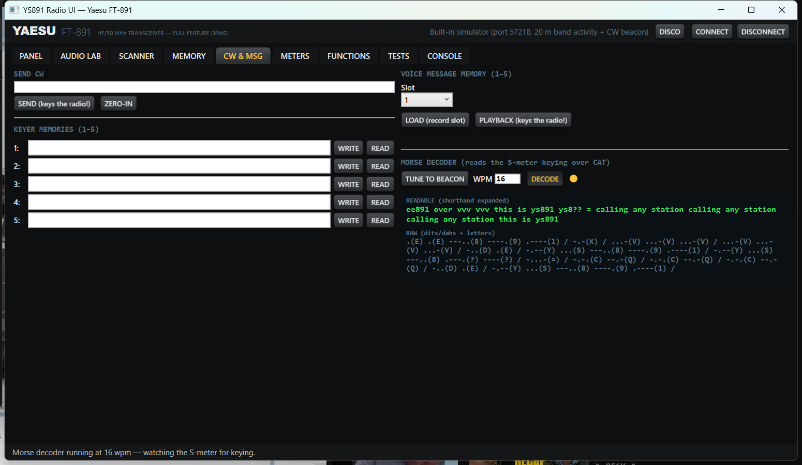

## Memory, Meters, Functions

Full memory-channel surface (go/read/write-with-tag, CH▲▼, VFO⇄MEM, quick memory bank, read-all
1–99 with double-click recall):

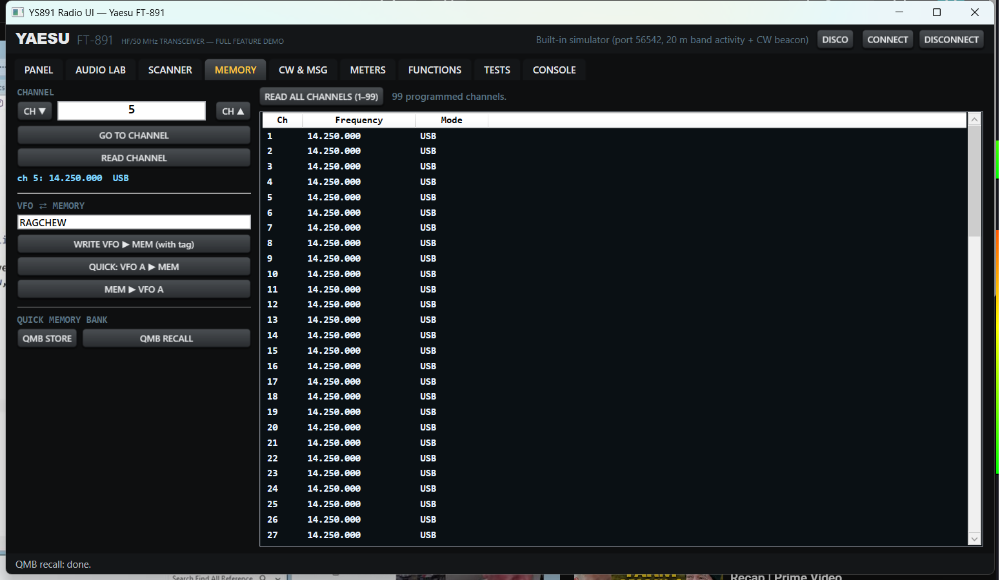

All seven meter types polled live, busy flag, radio identity/status reads, VFO B access:

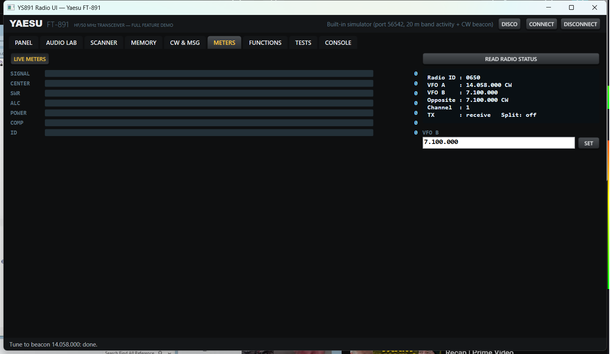

Everything the radio buries in menus — receiver trims, DSP (notch/contour/bandwidth/IF shift),
transmitter (power/processor/VOX/tuner/CTCSS/offset), CW keyer, system (dimmer/fast-step/AI/scan),
and a confirmed power-off:

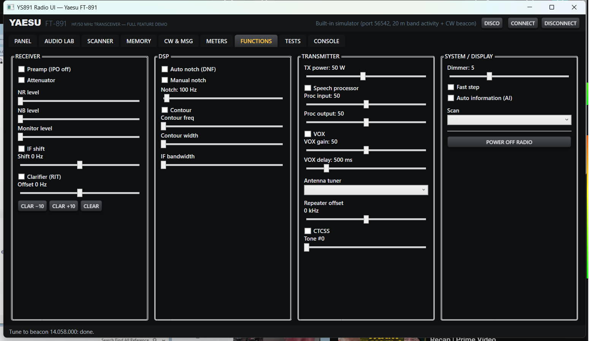

## Tests — the library walk

One tile per read command in the library, ~60 in all. Neon blue pending → yellow executing →
green pass / red fail, at a deliberate 100 ms cadence so you can watch it walk the API. Plus
`InitializeLibraryAsync` calibration (times real round-trips and tunes the inter-command delay
to the radio actually on the wire).

| Mid-run | Complete — **60/60 green** against the simulator |
|---|---|
| 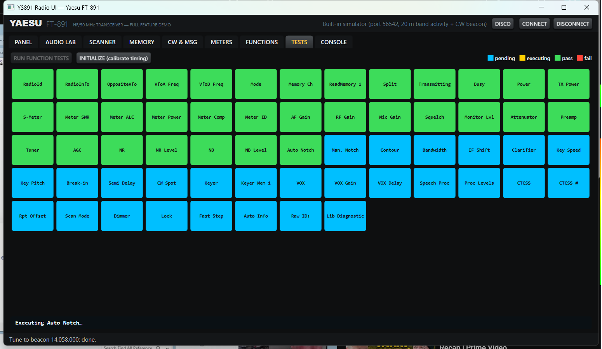 | 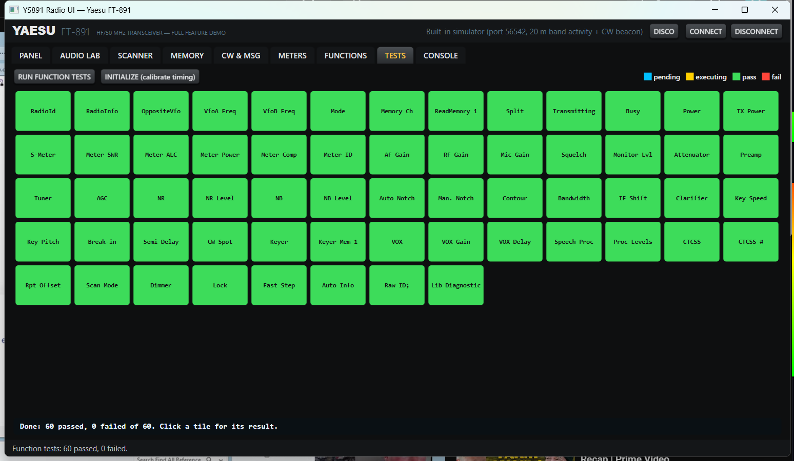 |

## Console — the wire, visible

Raw CAT commands, the live frame trace (`→ FA014250000;` / `← …`), last-response hex dump, and
live sliders for `InterCommandDelayMs` and `TimeoutRetryCount`:

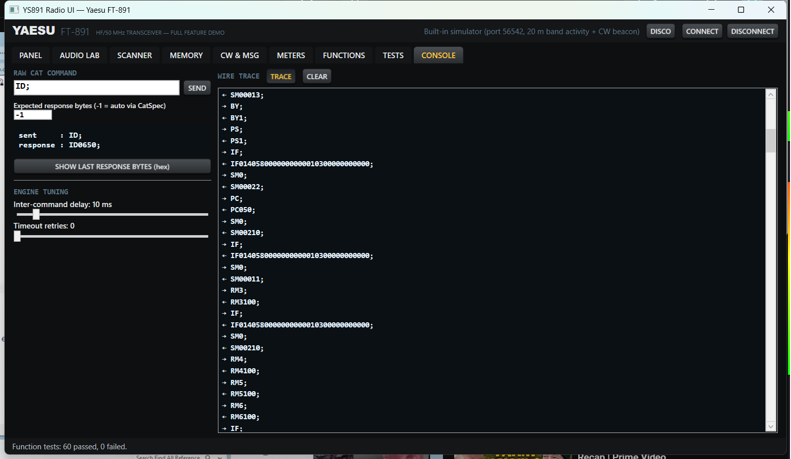

## Disco mode

Code should be fun. Flat-colour lights, a hard strobe, a light-up dance floor and a scrolling
marquee — all slamming on the beat via a crude energy-spike detector fed by the loopback audio.
The DJ booth plays any MP3/WAV (♫ LOAD TRACK) and auto-starts loopback so the lights hear the
music. There is also a button labelled **▶ PLAY HIT SINGLE**. You know the rules, and so do I.

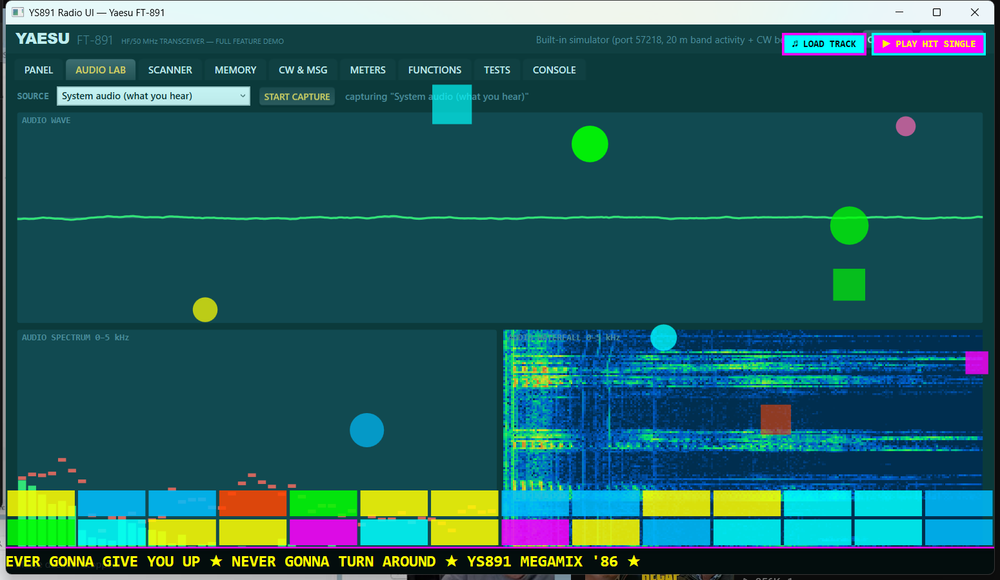
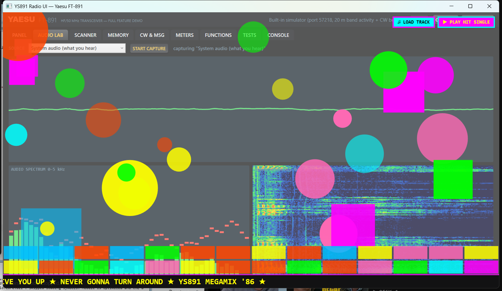

---

## Run it

```
dotnet build YS891-Radio-UI.slnx
YS891.RadioUI\bin\Debug\net48\YS891-Radio-UI.exe --sim    # straight into the built-in simulator
```

Real hardware: CONNECT → Serial, pick the COM port (radio CAT RATE 38400). Everything in this
tour is pure CAT and works identically on the bench — see [TESTING.md](TESTING.md) for the
checklist and [COVERAGE.md](COVERAGE.md) for the member-by-member map.
